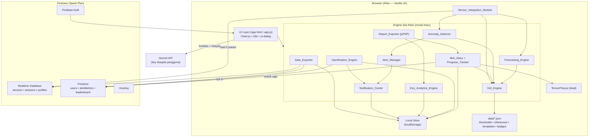
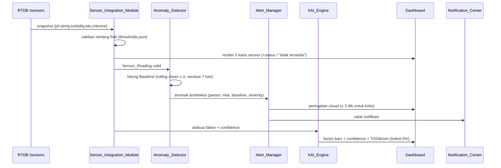

# Design Document — Advanced Features Upgrade

## Overview

Dokumen desain ini menjabarkan arsitektur teknis untuk sebelas kapabilitas lanjutan AQUENT yang didefinisikan pada `requirements.md`. Seluruh fitur dibangun **di atas arsitektur yang sudah ada** — aplikasi web statis multi-halaman berbasis *vanilla JavaScript*, di-deploy pada Firebase Hosting, dengan Firebase Realtime Database (RTDB) untuk data sensor real-time, Firestore untuk data profil/peran, dan `localStorage` untuk data per-perangkat (sesi, badge, XP, preferensi).

### Prinsip Desain Inti

1. **Spark-plan friendly (tanpa Cloud Functions wajib).** Seluruh komputasi baru (peramalan, deteksi anomali, atribusi XAI, gamifikasi, eco-analytics, ekspor) berjalan **di sisi klien**. Cloud Functions yang sudah ada (`functions/index.js`) tetap opsional dan tidak menjadi syarat fungsionalitas inti.
2. **Vanilla JS, tanpa build framework.** Modul baru ditulis sebagai berkas `.js` biasa yang dimuat via `<script>` dan mengekspos fungsi global, mengikuti pola `app.js`, `auth.js`, dan `i18n.js`. Tidak ada bundler/transpiler wajib.
3. **Reuse, bukan reinvent.** Desain menggunakan ulang aset yang sudah ada:
   - **Charting**: Chart.js 4.4.0 (sudah dimuat di `app.html`, dipakai `ecoChart` & `histChart`).
   - **i18n**: mekanisme `t()`, `applyI18n()`, event `langchange` dari `i18n.js`.
   - **Thresholds**: `data/thresholds.json` sebagai *single source of truth* rentang & bobot XAI.
   - **Template XAI/notifikasi**: `data/notification_templates.json`, `prompts/xai-explanation.md`.
   - **Referensi ilmiah**: `data/references.json` untuk narasi XAI.
   - **Water Quality Score engine**: `calcQualityScore()` / `scoreParam()` di `app.js`.
4. **Privacy-first.** Skin Diary memproses citra **secara lokal**; hanya metrik numerik turunan yang boleh disinkronkan. Ekspor PDF & data berjalan penuh di klien tanpa server pihak ketiga.
5. **Determinisme XAI.** Atribusi faktor dan skor untuk `Sensor_Reading` identik harus deterministik (tidak ada keacakan pada jalur produksi).

### Pemetaan Requirement → Komponen

| Requirement | Komponen Utama |
|---|---|
| R1 Peramalan | `Forecasting_Engine` (`forecasting.js`) |
| R2 Anomali & Alert | `Anomaly_Detector` + `Alert_Manager` (`anomaly.js`, `alerts.js`) |
| R3 AI Konsultan | perluasan modul AI di `app.js` (`ai-context.js`) |
| R4 TDS + Klorin | perluasan `Sensor_Integration_Module` + `XAI_Engine` |
| R5 Skin Diary | `Skin_Diary` + `Progress_Tracker` (`skin-diary.js`) |
| R6 Gamifikasi | `Gamification_Engine` (`gamification.js`) |
| R7 Eco-Analytics | `Eco_Analytics_Engine` (`eco-analytics.js`) |
| R8 Notification Center | `Notification_Center` (`notifications.js`) |
| R9 Ekspor PDF | `Report_Exporter` (`report-export.js`) |
| R10 Ekspor Data | `Data_Exporter` (`data-export.js`) |
| R11 Transparansi XAI | `XAI_Engine` (`xai.js`) — lintas-fitur |

### Keputusan Teknis Kunci & Rasionalnya

- **Algoritma peramalan: regresi linear kuadrat terkecil + dekomposisi musiman jam-per-hari.** Dipilih karena ringan (O(n)), deterministik, dapat dijalankan < 2 detik untuk 30 hari data di klien, dan tidak memerlukan pustaka ML berat. Dukung oleh Ahmed & Mumtaz (2019) yang memvalidasi pendekatan prediksi multi-parameter; AQUENT memakai pendekatan statistik sederhana alih-alih ML berat agar sesuai batasan klien/Spark.
- **Deteksi anomali: z-score terhadap rata-rata bergerak (rolling mean ± k·σ).** Standar industri untuk deteksi sederhana, deterministik, dan dapat dijelaskan (explainable) — sejalan dengan kebutuhan transparansi XAI. Mengacu pada pendekatan statistik pada Zhang & Zhao (2023) namun disederhanakan dari LSTM ke metode statistik agar berjalan di klien.
- **Atribusi XAI: rule-based weighted attribution (gaya SHAP additif).** Kontribusi tiap parameter = (bobot dari `thresholds.json`) × (defisit skor parameter), dinormalisasi 100%. Landasan teoretis: konsep SHAP (Lundberg & Lee, 2020) diimplementasikan sebagai atribusi bobot deterministik, bukan SHAP ML klasik (sesuai catatan di `references.json`).
- **PDF di klien: pustaka `jsPDF` (+ `jspdf-autotable`).** Dimuat via CDN/`<script>` mengikuti pola Chart.js. Membuat PDF sepenuhnya di browser, memenuhi kebutuhan privasi (R9.1).
- **Penyimpanan Skin Diary: `localStorage` (kanonik) + Firestore (opsional, metrik saja).** Citra mentah tidak pernah meninggalkan perangkat (R5.2). Sinkronisasi dua-arah dengan status "tertunda" untuk ketahanan jaringan (R5.4).

---

## Architecture

### Diagram Arsitektur Tingkat Tinggi



### Pola Pemuatan Modul

Setiap engine baru adalah berkas `.js` yang dimuat di `app.html` setelah `app.js`, mengekspos fungsi global ber-namespace (mis. `AquaForecast.*`, `AquaAnomaly.*`, `AquaXAI.*`). Pola ini konsisten dengan gaya prosedural `app.js` yang ada. Komunikasi antar-modul memakai:

- **State bersama**: objek `state` global di `app.js` (sensor terkini, sesi, skinType, db).
- **Event kustom**: `CustomEvent` pada `document` (mis. `aquent:newReading`, `aquent:notification`, `langchange`) untuk *loose coupling*.
- **Pembacaan langsung** `data/*.json` via `fetch` (di-cache satu kali saat boot, seperti `loadThresholds()`).

### Aliran Data Sensor (perluasan 5 parameter)



### Strategi Penyimpanan

| Data | Lokasi Kanonik | Sinkronisasi | Alasan |
|---|---|---|---|
| Sensor real-time (5 param) | RTDB `/sensors` | baca-saja | Sudah ada; latensi rendah (Rachman 2022) |
| Riwayat sesi | `localStorage` `aquent-sessions` | RTDB `/sessions/{uid}` (best-effort) | Pola eksisting `saveCurrentSession()` |
| Skin Diary (metrik + citra) | `localStorage` per profil | Firestore `skinMetrics` (metrik saja, opt-in) | Privasi: citra tidak ke server (R5.2) |
| Gamifikasi (XP, badge, streak, challenge) | `localStorage` | Firestore `leaderboard` (opt-in) | Privasi & Spark |
| Notifikasi | `localStorage` per profil | — | Per-profil lokal (R8.8) |
| Preferensi Eco (tarif, faktor emisi, baseline) | `localStorage` | — | Konfigurasi pengguna (R7) |
| Profil & peran | Firestore `users/{uid}` | — | Pola eksisting `auth.js` |

---

## Components and Interfaces

Bagian ini mendefinisikan kontrak (signature fungsi) tiap komponen. Tipe ditulis sebagai anotasi JSDoc-style untuk kejelasan; implementasinya tetap *plain JS*.

### 1. Sensor_Integration_Module (perluasan — R4)

```js
/**
 * @typedef {Object} SensorReading
 * @property {number|null} ph
 * @property {number|null} temperature   // °C
 * @property {number|null} turbidity      // NTU
 * @property {number|null} tds            // ppm
 * @property {number|null} chlorine       // mg/L
 * @property {number} ts                  // epoch ms
 */

const AquaSensors = {
  /** Baca snapshot RTDB → SensorReading; nilai hilang = null (bukan placeholder). */
  parseReading(rawSnapshot) /* => SensorReading */,

  /** True bila parameter ada di sumber (termasuk nilai 0). null/undefined => false. */
  isAvailable(reading, param) /* => boolean */,

  /** Validasi terhadap rentang fisik thresholds.json. Nilai 0 dianggap valid. */
  isPhysicallyValid(param, value, TH) /* => boolean */,

  /** Status diskret rendah/normal/tinggi berbasis thresholds.json. */
  classifyStatus(param, value, TH) /* => 'low'|'normal'|'high'|'unavailable' */,
};
```

- TDS & klorin dibaca dari `/sensors` bersama tiga parameter lama (R4.1).
- Jika nilai tidak tersedia → kartu menampilkan teks i18n `common.notAvailable` (R4.2), bukan `0`/placeholder.
- TDS & klorin disertakan saat menyimpan sesi (R4.9) dengan memperluas objek `session` di `saveCurrentSession()`.

### 2. Forecasting_Engine (R1)

```js
const AquaForecast = {
  /**
   * @param {SensorReading[]} history  data historis (>= 7 hari, >= 24 reading)
   * @param {number} horizonHours      default 24
   * @returns {ForecastResult|{status:'insufficient_data'}}
   */
  forecast(history, horizonHours = 24) /* => ForecastResult */,

  /** Regresi linear kuadrat-terkecil deterministik untuk satu parameter. */
  linearFit(points) /* => {slope, intercept} */,

  /** Komponen musiman: rata-rata simpangan per jam-dalam-hari. */
  seasonalProfile(history, param) /* => number[24] */,

  /** Confidence 0–100 dari R² + kecukupan & kebaruan data. */
  computeConfidence(history, param, fit) /* => number */,
};

/**
 * @typedef {Object} ForecastResult
 * @property {{ph,temperature,turbidity,tds,chlorine}} projected  nilai per param pada horizon
 * @property {number} projectedScore        proyeksi Water_Quality_Score
 * @property {number} confidence            0–100
 * @property {boolean} notRecommended        true bila projectedScore < 60
 * @property {Array<{ts,actual?,projected?}>} series  untuk grafik garis
 */
```

- **Algoritma**: untuk tiap parameter, gabungkan tren linear (`linearFit`) dengan profil musiman per jam (`seasonalProfile`) → nilai proyeksi pada horizon. `projectedScore` dihitung ulang via `calcQualityScore()` eksisting atas nilai proyeksi.
- **Gerbang kecukupan data** (R1.3): jika `< 7 hari` rentang **atau** `< 24` reading valid → kembalikan `{status:'insufficient_data'}`; UI menampilkan teks "data tidak cukup".
- **Nilai 0 valid** (R1.4): tidak ada penyaringan nilai nol; hanya nilai di luar rentang fisik yang dikecualikan.
- **Anggaran kinerja** (R1.9): seluruh perhitungan O(n) atas ≤ 30 hari; target < 2 dtk (lihat Testing Strategy untuk pengukuran).
- **Grafik** (R1.7): satu line chart Chart.js menampilkan deret historis + proyeksi (garis putus-putus).

### 3. Anomaly_Detector (R2, R4.6)

```js
const AquaAnomaly = {
  /**
   * Baseline per parameter dari window 7 hari.
   * @returns {{mean:number, std:number}}  std >= MIN_STD bila semua nilai identik
   */
  computeBaseline(history, param, TH) ,

  /** True bila |value - mean| > k*std (default k=3). */
  isAnomaly(value, baseline, k = 3) /* => boolean */,

  /**
   * Evaluasi satu reading → daftar anomali (mengecualikan nilai tak-valid fisik).
   * @returns {Anomaly[]}
   */
  evaluate(reading, history, TH) ,
};

/**
 * @typedef {Object} Anomaly
 * @property {string} param
 * @property {number} value
 * @property {number} baseline
 * @property {number} deviations           // berapa σ
 * @property {'critical'|'warning'|'info'} severity
 */
const MIN_STD = 0.01; // deviasi standar minimum positif terkonfigurasi (R2.2)
```

- Baseline = rata-rata bergerak + deviasi standar dari window 7 hari (R2.1).
- Bila seluruh nilai identik (σ=0) → pakai `MIN_STD` (R2.2) agar tidak terjadi pembagian nol / semua dianggap anomali.
- Reading di luar rentang fisik `thresholds.json` ditandai tak-valid dan **dikecualikan dari perhitungan baseline** (R2.6).
- TDS > 300 ppm dan klorin di luar [0.1, 0.5] memicu jalur alert khusus (R4.6, R4.7) selain jalur z-score.

### 4. Alert_Manager (R2.4–R2.9, R4.6–R4.7)

```js
const AquaAlerts = {
  /** Bangun alert dari anomali + template notification_templates.json. */
  createAlert(anomaly) /* => Alert */,

  /** Klasifikasi severity → kategori notifikasi. */
  classify(alert) /* => 'critical'|'warning'|'info' */,

  /** Tampilkan + catat ke Notification_Center; hormati preferensi kategori. */
  dispatch(alert, prefs) /* => {shown:boolean, logged:boolean} */,

  /** True bila kategori dinonaktifkan pengguna. */
  isSuppressed(category, prefs) /* => boolean */,
};

/**
 * @typedef {Object} Alert
 * @property {string} param
 * @property {number} value
 * @property {number} baseline
 * @property {'critical'|'warning'|'info'} severity
 * @property {string} category    // 'water_quality'|'gamification'|'reminder'|'education'
 * @property {string} title       // dari template (i18n)
 * @property {string} body
 * @property {number} ts
 */
```

- Setiap alert memuat nama parameter, nilai terukur, baseline, dan severity (R2.4–R2.5).
- Alert kritis tampil di Dashboard ≤ 3 dtk (R2.7) — di-*dispatch* sinkron pada event `aquent:newReading`.
- Semua alert dicatat ke `Notification_Center` (R2.8).
- Jika kategori dinonaktifkan → `dispatch` menahan tampilan tetapi keputusan ini deterministik (R2.9).

### 5. AI_Consultant (perluasan — R3)

```js
const AquaAI = {
  /** Rakit konteks: sensor terkini + skinType + ringkasan riwayat sesi. */
  buildContext(state, sessionHistory) /* => string */,

  /** Pangkas konteks agar <= MAX_CONTEXT_TOKENS (estimasi). */
  truncateContext(contextStr, maxTokens) /* => string */,

  /** Pertahankan riwayat percakapan satu sesi (array pesan). */
  appendTurn(conversation, role, text) /* => Message[] */,

  /** Kirim ke Gemini dengan preferensi bahasa + timeout 30s. */
  send(conversation, contextStr, lang, apiKey) /* => Promise<AIResponse> */,
};
```

- Menyertakan `SensorReading` terkini + tipe kulit `Active_Profile` (R3.1) dan ringkasan riwayat sesi (R3.2).
- Riwayat percakapan dipertahankan dalam array `conversation` selama sesi obrolan (R3.3).
- Bila API key kosong → tahan pengiriman + tampilkan instruksi (R3.5). Bila gagal/timeout 30 dtk → pesan kesalahan + saran (R3.6).
- Disclaimer non-medis ditampilkan tiap sesi (R3.7). Preferensi bahasa dikirim (R3.8). Konteks dipangkas ≤ ambang token (R3.9).

### 6. Skin_Diary + Progress_Tracker (R5)

```js
const AquaSkinDiary = {
  /** Simpan entri (metrik turunan saja) ke localStorage per profil. */
  saveEntry(entry, profileId) /* => SkinEntry */,

  /** Sinkron metrik (tanpa citra) ke Firestore; tandai 'pending' bila gagal. */
  syncEntry(entry, profileId) /* => Promise<'synced'|'pending'> */,

  /** Hapus entri secara atomik dari lokal + Firestore (all-or-nothing). */
  deleteEntry(entryId, profileId) /* => Promise<{ok:boolean}> */,

  /** Entri terbaru lebih tua dari 14 hari → true (pengingat). */
  needsScanReminder(entries, now) /* => boolean */,
};

const AquaProgress = {
  /** Deret tren metrik untuk rentang 7/30/90 hari. */
  trendSeries(entries, metric, rangeDays) /* => Array<{ts,value}> */,

  /** Delta metrik antara entri terbaru dan sebelumnya. */
  delta(entries, metric) /* => number|null */,

  /** Korelasi visual tren kulit vs Water_Quality_Score (deret selaras waktu). */
  alignWithWaterScore(entries, sessions, rangeDays) /* => AlignedSeries */,
};

/**
 * @typedef {Object} SkinEntry
 * @property {string} id
 * @property {string} profileId
 * @property {number} ts
 * @property {{saturation,redness,oiliness,texture,sharpness}} metrics
 * @property {number} score
 * @property {string} skinType
 * @property {number} confidence
 * @property {'local'|'synced'|'pending'} syncStatus
 */
```

- Metrik diambil dari pipeline lokal `analyzeImagePixels()` + `buildLocalScanResult()` yang sudah ada (R5.1–R5.2).
- Sinkron Firestore hanya metrik numerik (R5.3); kegagalan → `pending` + retry latar belakang (R5.4).
- Hapus entri bersifat **atomik**: lokal + Firestore harus dua-duanya sukses; jika salah satu gagal → operasi dianggap gagal dan kedua salinan dipertahankan konsisten (R5.8).
- Progress menampilkan tren (R5.5), delta antar entri (R5.6), korelasi dengan WQS (R5.7), dan pengingat > 14 hari (R5.10).

### 7. Gamification_Engine (R6)

```js
const AquaGamify = {
  /** Hitung streak harian dari daftar sesi (berdasarkan hari kalender). */
  computeStreak(sessions, now) /* => number */,

  /** True bila streak mencapai tonggak {7,14,21,30,60,100}. */
  milestoneReached(prevStreak, newStreak) /* => number|null */,

  /** Evaluasi kriteria tantangan terhadap data sesi. */
  evaluateChallenge(challenge, sessions) /* => {complete:boolean, progress:number} */,

  /** Total poin → level via ambang terdefinisi. */
  levelForPoints(points, thresholds) /* => {level:number, name:string} */,

  /** Bangun papan peringkat hanya dari peserta opt-in (display name, tanpa email). */
  buildLeaderboard(entries) /* => LeaderboardRow[] */,
};
```

- Streak +1 untuk hari kalender berurutan (R6.1); reset ke 0 bila satu hari penuh terlewat (R6.2).
- Tonggak memberi penghargaan + catat notifikasi (R6.3) memakai template `streak_milestone`.
- ≥ 3 tantangan terstruktur dengan kriteria terukur (R6.4); selesai → tambah poin (R6.5); belum → tahan (R6.6).
- Level dari poin (R6.7); leaderboard opt-in (R6.8–R6.9); identitas pakai display name, tanpa email (R6.10).

### 8. Eco_Analytics_Engine (R7)

```js
const AquaEco = {
  /** Total konsumsi air per periode (harian/mingguan/bulanan). 0 valid. */
  totalConsumption(sessions, period) /* => number */,

  /** Biaya = konsumsi × tarif (default terdokumentasi bila belum diatur). */
  estimateCost(liters, ratePerLiter) /* => {value, isEstimate} */,

  /** Emisi CO2 dari energi pemanas air × faktor emisi (default bila kosong). */
  estimateCO2(sessions, emissionFactor) /* => {value, isEstimate} */,

  /** Air dihemat vs baseline yang dapat dikonfigurasi. */
  waterSaved(sessions, baselineLiters) /* => number */,
};

const ECO_DEFAULTS = {
  ratePerLiter: 0.005,      // contoh tarif PDAM (terdokumentasi), unit mata uang lokal
  emissionFactor: 0.0002,   // kg CO2 per liter air panas (terdokumentasi)
  baselineLitersPerSession: 60,
};
```

- Konsumsi nol diperlakukan valid (R7.2). Default terdokumentasi dipakai bila belum diatur + hasil ditandai estimasi (R7.5, R7.9).
- Biaya & emisi disajikan dalam grafik tren Chart.js (R7.7); format mata uang/satuan mengikuti bahasa (R7.8).

### 9. Notification_Center (R8)

```js
const AquaNotif = {
  /** Tambah notifikasi (per profil). */
  add(notif, profileId) /* => Notification */,

  /** Daftar terurut terbaru-dulu, opsional filter kategori. */
  list(profileId, category) /* => Notification[] */,

  /** Jumlah belum dibaca. */
  unreadCount(profileId) /* => number */,

  markRead(id, profileId), markAllRead(profileId), remove(id, profileId),
};

/**
 * @typedef {Object} Notification
 * @property {string} id
 * @property {string} profileId
 * @property {string} category   // 'water_quality'|'gamification'|'reminder'|'education'
 * @property {string} title
 * @property {string} body
 * @property {number} ts
 * @property {boolean} read
 */
```

- Urut terbaru-dulu (R8.1); penambahan dari Alert_Manager/Gamification/penjadwal (R8.2); badge unread (R8.3); mark read/all (R8.4–R8.5); filter kategori (R8.6); hapus (R8.7); per profil (R8.8); i18n (R8.9).

### 10. Report_Exporter (R9)

```js
const AquaReport = {
  /** Bangun model laporan dari data tersedia (sebagian boleh kosong). */
  buildReportModel(sessions, skinEntries, range, profile, lang) /* => ReportModel */,

  /** Render PDF via jsPDF di klien (tanpa server). */
  renderPDF(model) /* => Blob */,
};
```

- PDF dibuat di klien (R9.1) memuat ringkasan WQS, 5 parameter, atribusi XAI, rentang waktu (R9.2), opsional tren kulit (R9.3), stempel waktu + nama profil (R9.4), bahasa antarmuka saat ekspor (R9.5), keterangan data hilang (R9.6), disclaimer non-medis (R9.7), target < 5 dtk untuk 30 hari (R9.8).

### 11. Data_Exporter (R10)

```js
const AquaDataExport = {
  /** Kumpulkan seluruh data pengguna (best-effort per sumber). */
  collect(uid, profileId) /* => Promise<{data, failures:string[]}> */,

  /** Bungkus jadi berkas JSON unduhan + metadata. */
  buildExport(collected, uid) /* => {blob:Blob, json:Object} */,
};
```

- Kumpulkan sesi, profil, survei, badge, entri Skin Diary, notifikasi (R10.1); format JSON (R10.2); kecualikan citra mentah (R10.3); stempel waktu + pengenal (R10.4); kegagalan sebagian → lapor + tetap ekspor data yang ada (R10.5); kegagalan total → tahan + pesan kesalahan (R10.6); klien-saja (R10.7); akses dari halaman akun (R10.8).

### 12. XAI_Engine (lintas-fitur — R4.4–R4.5, R11)

```js
const AquaXAI = {
  /**
   * Atribusi faktor untuk Water_Quality_Score (deterministik).
   * contribution_i = weight_i * deficit_i, dinormalisasi ke 100%.
   * @returns {FactorAttribution[]}
   */
  attributeScore(reading, TH) ,

  /** Faktor info terpisah untuk TDS & klorin (bobot 0%, tidak ubah skor). */
  sideFactors(reading, TH) /* => SideFactor[] */,

  /** Narasi + rujukan ilmiah dari references.json untuk satu faktor. */
  explainFactor(param, reading, TH, references) /* => {text, citations[]} */,

  /** Confidence umum untuk output (forecast/anomaly/scan). */
  confidence(kind, payload) /* => number */,
};

/**
 * @typedef {Object} FactorAttribution
 * @property {string} param
 * @property {number} contributionPct   // jumlah seluruh = 100
 * @property {number} paramScore         // 0–100
 * @property {number} weight             // dari thresholds.json
 */
```

- Kontribusi persentase tiap parameter terhadap skor (R11.1); confidence pada forecast/anomaly/scan (R11.2); narasi + rujukan (R11.3); pernyataan eksplisit TDS/klorin bobot 0% + alasan (R4.5, R11.4); peringatan bila confidence < 50% (R11.5); i18n penuh (R11.6); **determinisme** untuk reading identik (R11.7).

---

## Data Models

### Model `localStorage` (kanonik klien)

```js
// aquent-sessions  (sudah ada — diperluas TDS & klorin)
[{
  ts: 1714400000000, profileId: 'default',
  ph: 7.2, temperature: 38, turbidity: 0.3,
  tds: 180, chlorine: 0.3,                 // BARU (R4.9)
  duration_min: 8, volume_liters: 80,
  quality_score: 88, water_saved_pct: 12
}]

// aquent-skin-diary-{profileId}            (BARU — R5)
[{
  id: 'sd_1714400000000', profileId: 'p1', ts: 1714400000000,
  metrics: { saturation: 62, redness: 28, oiliness: 41, texture: 73, sharpness: 55 },
  score: 78, skinType: 'normal', confidence: 64,
  syncStatus: 'synced'                      // 'local' | 'synced' | 'pending'
}]

// aquent-notifications-{profileId}         (BARU — R8)
[{ id, profileId, category, title, body, ts, read }]

// aquent-gamify-{profileId}                (BARU — R6; XP lama tetap kompatibel)
{
  points: 240, streak: 14, lastSessionDay: '2026-04-29',
  challenges: { 'grade-a-5in7': { progress: 3, complete: false } },
  optInLeaderboard: false, displayName: 'Aqua'
}

// aquent-eco-prefs                          (BARU — R7)
{ ratePerLiter: 0.005, emissionFactor: 0.0002, baselineLitersPerSession: 60, currency: 'IDR' }

// aquent-alert-prefs                        (BARU — R2.9)
{ water_quality: true, gamification: true, reminder: true, education: false }
```

### Model Firestore (opsional, opt-in)

```
users/{uid}                          // EKSISTING (auth.js): email, displayName, role, plan
users/{uid}/skinMetrics/{entryId}    // BARU — metrik numerik SAJA, tanpa citra (R5.3)
  { ts, metrics:{...}, score, skinType, confidence }       // tidak ada field gambar
leaderboard/{uid}                    // BARU — hanya peserta opt-in (R6.8)
  { displayName, points, level, updatedAt }                // TANPA email (R6.10)
```

> **Catatan aturan keamanan**: `firestore.rules` perlu ditambah `match /users/{uid}/skinMetrics/{id}` (read/write hanya pemilik) dan `match /leaderboard/{uid}` (write pemilik, read publik untuk peserta opt-in). Citra tidak pernah ditulis ke server.

### Model RTDB (perluasan)

```
/sensors        { ph, temperature, turbidity, tds, chlorine }   // tds & chlorine BARU dibaca (R4.1)
/sessions/{uid} { <ts>: {…, tds, chlorine} }                    // EKSISTING + 2 field
```

### Konstanta Konfigurasi (terdokumentasi)

```js
const FORECAST_MIN_DAYS = 7;          // R1.3
const FORECAST_MIN_READINGS = 24;     // R1.3
const FORECAST_HORIZON_H = 24;        // R1.1
const FORECAST_NOT_REC_SCORE = 60;    // R1.6
const ANOMALY_K = 3;                  // R2.3
const ANOMALY_MIN_STD = 0.01;         // R2.2
const CONFIDENCE_LOW = 50;            // R11.5
const STREAK_MILESTONES = [7,14,21,30,60,100]; // R6.3
const LEVEL_THRESHOLDS = [0,100,300,500];       // R6.7 (Bronze/Silver/Gold/Platinum)
const SKIN_SCAN_REMINDER_DAYS = 14;   // R5.10
const AI_TIMEOUT_MS = 30000;          // R3.6
const PDF_RANGE_BUDGET_MS = 5000;     // R9.8 (30 hari)
```

---

## Correctness Properties

*Sebuah properti (property) adalah karakteristik atau perilaku yang harus selalu benar di seluruh eksekusi valid sebuah sistem — pada dasarnya pernyataan formal tentang apa yang seharusnya dilakukan sistem. Properti menjadi jembatan antara spesifikasi yang dapat dibaca manusia dan jaminan kebenaran yang dapat diverifikasi mesin.*

Properti berikut diturunkan dari prework analisis acceptance criteria. Kriteria yang bersifat UI/i18n murni, kinerja, dan integrasi LLM eksternal dikecualikan dari daftar properti (ditangani sebagai unit/integration/benchmark test pada Testing Strategy). Properti yang redundan telah dikonsolidasikan sesuai Property Reflection.

### Property 1: Forecast menghasilkan output well-formed

*Untuk setiap* `Historical_Window` yang mencukupi (≥ 7 hari rentang dan ≥ 24 reading valid), `forecast()` menghasilkan `projectedScore` numerik dalam rentang [0, 100], nilai proyeksi untuk kelima parameter (pH, suhu, turbidity, TDS, klorin) yang semuanya berhingga (finite), dan deret yang mencakup horizon yang diminta.

**Validates: Requirements 1.1, 1.2**

### Property 2: Gerbang kecukupan data peramalan

*Untuk setiap* `Historical_Window` yang memiliki kurang dari 7 hari rentang **atau** kurang dari 24 reading valid, `forecast()` mengembalikan status `insufficient_data` dan tidak menghasilkan proyeksi.

**Validates: Requirements 1.3**

### Property 3: Nilai nol diperlakukan valid pada peramalan

*Untuk setiap* `Historical_Window` yang mengandung pembacaan bernilai nol (dalam rentang fisik valid), jumlah titik data yang digunakan dalam perhitungan proyeksi sama dengan jumlah pembacaan yang valid secara fisik — nilai nol tidak pernah dibuang.

**Validates: Requirements 1.4**

### Property 4: Penandaan "tidak direkomendasikan"

*Untuk setiap* hasil peramalan, flag `notRecommended` bernilai benar jika dan hanya jika `projectedScore < 60`.

**Validates: Requirements 1.6**

### Property 5: Confidence selalu dalam rentang valid

*Untuk setiap* keluaran analitik berjenis peramalan, deteksi anomali, atau pemindaian kulit, `Confidence_Score` yang dihasilkan selalu berada dalam rentang [0, 100].

**Validates: Requirements 1.5, 11.2**

### Property 6: Baseline cocok dengan statistik rujukan

*Untuk setiap* window numerik, `computeBaseline()` menghasilkan `mean` yang sama dengan rata-rata aritmetika window dan `std` yang sama dengan deviasi standar window (dalam batas epsilon) terhadap implementasi rujukan independen.

**Validates: Requirements 2.1**

### Property 7: Deviasi standar minimum positif untuk window konstan

*Untuk setiap* window yang seluruh nilainya identik, `computeBaseline().std` sama dengan `ANOMALY_MIN_STD` dan bernilai positif (tidak pernah nol).

**Validates: Requirements 2.2**

### Property 8: Ambang anomali z-score

*Untuk setiap* baseline dan nilai pembacaan, `isAnomaly()` bernilai benar jika dan hanya jika `|value − mean| > k · std` (dengan k = 3 default).

**Validates: Requirements 2.3**

### Property 9: Alert anomali memuat seluruh atribut wajib

*Untuk setiap* anomali, `createAlert()` menghasilkan alert yang memuat nama parameter, nilai terukur, nilai baseline, dan tingkat keparahan yang merupakan salah satu dari {critical, warning, info}, semuanya konsisten dengan anomali masukan.

**Validates: Requirements 2.4, 2.5**

### Property 10: Pembacaan tak-valid fisik dikeluarkan dari baseline

*Untuk setiap* `Historical_Window` yang mengandung nilai di luar rentang fisik `thresholds.json`, baseline yang dihitung sama dengan baseline yang dihitung hanya atas subset pembacaan yang valid secara fisik.

**Validates: Requirements 2.6**

### Property 11: Dispatch alert menghormati preferensi kategori

*Untuk setiap* alert dan konfigurasi preferensi, alert ditampilkan dan dicatat ke `Notification_Center` jika dan hanya jika kategorinya tidak dinonaktifkan; bila kategori dinonaktifkan, tampilan ditahan.

**Validates: Requirements 2.8, 2.9**

### Property 12: Konteks AI memuat kondisi sensor dan tipe kulit

*Untuk setiap* state sensor dan tipe kulit `Active_Profile`, string konteks yang dibangun `buildContext()` memuat nilai kelima parameter sensor dan label tipe kulit.

**Validates: Requirements 3.1**

### Property 13: Konteks AI memuat ringkasan riwayat sesi

*Untuk setiap* riwayat sesi tak-kosong, string konteks yang dibangun memuat ringkasan riwayat sesi terbaru (mis. jumlah/rangkuman sesi).

**Validates: Requirements 3.2**

### Property 14: Riwayat percakapan dipertahankan terurut

*Untuk setiap* urutan giliran percakapan yang ditambahkan via `appendTurn()`, array percakapan hasil memiliki panjang sama dengan jumlah giliran yang ditambahkan dan mempertahankan urutannya.

**Validates: Requirements 3.3**

### Property 15: API key kosong menahan pengiriman

*Untuk setiap* nilai API key yang kosong atau hanya berisi whitespace, `send()` menahan pengiriman permintaan dan menandai bahwa instruksi konfigurasi harus ditampilkan.

**Validates: Requirements 3.5**

### Property 16: Preferensi bahasa disertakan pada permintaan AI

*Untuk setiap* bahasa antarmuka yang dipilih (id/en), payload permintaan ke AI memuat arahan preferensi bahasa tersebut.

**Validates: Requirements 3.8**

### Property 17: Pemangkasan konteks menghormati ambang token

*Untuk setiap* konteks/percakapan, keluaran `truncateContext()` memiliki estimasi jumlah token yang tidak melebihi `MAX_CONTEXT_TOKENS`.

**Validates: Requirements 3.9**

### Property 18: Ketersediaan parameter membedakan nilai hilang dari nol

*Untuk setiap* snapshot sensor, `isAvailable(reading, param)` bernilai benar ketika parameter ada (termasuk nilai 0) dan bernilai salah hanya ketika nilainya `null`/`undefined`; status yang ditampilkan adalah "tidak tersedia" hanya untuk nilai yang benar-benar hilang.

**Validates: Requirements 4.1, 4.2**

### Property 19: WQS independen terhadap TDS dan klorin

*Untuk setiap* `Sensor_Reading`, dengan pH/suhu/turbidity dipertahankan tetap, mengubah nilai TDS dan klorin secara sembarang tidak mengubah `Water_Quality_Score`; dan `sideFactors()` melaporkan TDS dan klorin dengan bobot 0% beserta alasannya.

**Validates: Requirements 4.5, 11.4**

### Property 20: Penjelasan XAI dihasilkan untuk parameter di luar rentang aman

*Untuk setiap* nilai TDS atau klorin di luar rentang aman, `explainFactor()` menghasilkan teks penjelasan tak-kosong beserta saran tindakan yang merujuk template XAI yang ada.

**Validates: Requirements 4.4**

### Property 21: Pemetaan alert TDS dan klorin berbasis ambang

*Untuk setiap* `Sensor_Reading`: alert air sadah dibuat jika dan hanya jika TDS > 300 ppm; alert klorin tinggi dibuat jika dan hanya jika klorin > 0.5 mg/L; alert klorin rendah dibuat jika dan hanya jika klorin < 0.1 mg/L.

**Validates: Requirements 4.6, 4.7**

### Property 22: Entri Encyclopedia ditandai relevan saat nilai di luar aman

*Untuk setiap* nilai TDS atau klorin di luar rentang aman, entri ensiklopedia yang terkait dengan parameter tersebut ditandai "relevan sekarang".

**Validates: Requirements 4.8**

### Property 23: Round-trip penyimpanan sesi mempertahankan TDS dan klorin

*Untuk setiap* sesi yang disimpan, rekaman yang tersimpan memuat field TDS dan klorin beserta seluruh metrik sesi, dan membaca kembali rekaman menghasilkan nilai yang sama dengan yang disimpan.

**Validates: Requirements 4.9, 5.1**

### Property 24: Tidak ada citra mentah pada payload tersimpan, sinkron, atau ekspor

*Untuk setiap* entri Skin Diary, payload yang ditulis ke penyimpanan lokal, payload yang disinkronkan ke Firestore, dan berkas ekspor data tidak pernah memuat field citra mentah — hanya metrik numerik turunan yang dipertahankan.

**Validates: Requirements 5.2, 5.3, 10.3**

### Property 25: Sinkron gagal menghasilkan status tertunda

*Untuk setiap* operasi sinkron metrik kulit yang gagal, status entri menjadi `pending` dan entri tetap dipertahankan untuk dicoba ulang.

**Validates: Requirements 5.4**

### Property 26: Tren metrik kulit tersaring oleh rentang waktu

*Untuk setiap* kumpulan entri dan rentang (7/30/90 hari), `trendSeries()` mengembalikan tepat entri yang stempel waktunya berada dalam jendela rentang tersebut.

**Validates: Requirements 5.5**

### Property 27: Delta metrik antar entri benar

*Untuk setiap* kumpulan entri dengan minimal dua entri, `delta()` untuk sebuah metrik sama dengan selisih nilai metrik entri terbaru dikurangi entri sebelumnya.

**Validates: Requirements 5.6**

### Property 28: Penyelarasan tren kulit dan WQS berbagi jendela waktu

*Untuk setiap* kumpulan entri kulit dan sesi pada rentang yang sama, `alignWithWaterScore()` menghasilkan deret kulit dan deret `Water_Quality_Score` yang mencakup jendela/rentang waktu yang identik.

**Validates: Requirements 5.7**

### Property 29: Penghapusan entri bersifat atomik (all-or-nothing)

*Untuk setiap* operasi hapus entri Skin Diary di mana salah satu sisi (lokal atau Firestore) gagal, kedua salinan dipertahankan dalam keadaan konsisten dan operasi dilaporkan gagal; ketika kedua sisi berhasil, kedua salinan terhapus.

**Validates: Requirements 5.8**

### Property 30: Pengingat pemindaian berdasarkan usia entri terbaru

*Untuk setiap* kumpulan entri, `needsScanReminder()` bernilai benar jika dan hanya jika entri terbaru berusia lebih dari 14 hari.

**Validates: Requirements 5.10**

### Property 31: Streak bertambah pada hari kalender berurutan

*Untuk setiap* himpunan sesi yang tercatat pada hari-hari kalender berurutan tanpa jeda hingga hari terkini, `computeStreak()` menghasilkan nilai streak yang sama dengan jumlah hari berurutan tersebut.

**Validates: Requirements 6.1**

### Property 32: Streak reset setelah satu hari penuh terlewat

*Untuk setiap* himpunan sesi yang mengandung satu hari kalender penuh tanpa sesi sebelum hari terkini, `computeStreak()` mengatur ulang streak (tidak melanjutkan hitungan dari sebelum jeda).

**Validates: Requirements 6.2**

### Property 33: Penghargaan tonggak streak dan notifikasi

*Untuk setiap* transisi streak yang melewati sebuah tonggak dalam {7, 14, 21, 30, 60, 100}, `milestoneReached()` mengembalikan tonggak tersebut dan sebuah notifikasi dicatat ke `Notification_Center`.

**Validates: Requirements 6.3**

### Property 34: Penyelesaian tantangan dan penambahan poin

*Untuk setiap* tantangan dan kumpulan sesi: tantangan ditandai selesai dan poinnya ditambahkan tepat sekali jika dan hanya jika seluruh kriteria terpenuhi; bila kriteria belum terpenuhi, penandaan selesai dan penambahan poin ditahan.

**Validates: Requirements 6.5, 6.6**

### Property 35: Level dipetakan dari total poin secara monoton

*Untuk setiap* nilai total poin, `levelForPoints()` mengembalikan level dengan ambang tertinggi yang tidak melebihi poin, dan pemetaan ini non-menurun terhadap kenaikan poin.

**Validates: Requirements 6.7**

### Property 36: Papan peringkat hanya memuat peserta opt-in

*Untuk setiap* kumpulan entri pengguna, himpunan baris papan peringkat sama persis dengan himpunan pengguna yang memilih ikut serta (opt-in); pengguna non opt-in tidak pernah muncul.

**Validates: Requirements 6.8, 6.9**

### Property 37: Identitas papan peringkat tidak mengekspos email

*Untuk setiap* kumpulan entri papan peringkat (meski memuat email pada data sumber), tidak ada baris keluaran yang mengekspos alamat email; identitas yang ditampilkan adalah nama tampilan.

**Validates: Requirements 6.10**

### Property 38: Total konsumsi air sama dengan jumlah volume periode

*Untuk setiap* kumpulan sesi dan periode, `totalConsumption()` sama dengan jumlah volume air seluruh sesi dalam periode tersebut; untuk periode tanpa sesi, hasilnya 0 (valid, bukan error/NaN).

**Validates: Requirements 7.1, 7.2**

### Property 39: Biaya air linear terhadap konsumsi dan tarif

*Untuk setiap* volume liter dan tarif per satuan, `estimateCost().value` sama dengan `liter × tarif` (dalam batas epsilon).

**Validates: Requirements 7.3**

### Property 40: Emisi CO₂ linear terhadap faktor emisi

*Untuk setiap* kumpulan sesi dan faktor emisi, estimasi emisi CO₂ berskala linear terhadap faktor emisi.

**Validates: Requirements 7.4**

### Property 41: Default terdokumentasi dipakai dan ditandai estimasi

*Untuk setiap* konfigurasi tarif atau faktor emisi yang belum diatur, nilai default terdokumentasi digunakan dan hasil ditandai sebagai estimasi (`isEstimate === true`).

**Validates: Requirements 7.5**

### Property 42: Air dihemat dihitung terhadap baseline

*Untuk setiap* kumpulan sesi dan baseline penggunaan yang dikonfigurasi, `waterSaved()` sama dengan selisih terhadap baseline sesuai formula yang terdefinisi.

**Validates: Requirements 7.6**

### Property 43: Daftar notifikasi terurut terbaru-dulu

*Untuk setiap* kumpulan notifikasi, `list()` mengembalikan notifikasi terurut menurun berdasarkan stempel waktu.

**Validates: Requirements 8.1**

### Property 44: Round-trip tambah/hapus notifikasi

*Untuk setiap* notifikasi yang ditambahkan, notifikasi tersebut muncul pada daftar profil yang sama; dan untuk setiap notifikasi yang dihapus, notifikasi tersebut tidak lagi muncul pada daftar maupun penyimpanan.

**Validates: Requirements 8.2, 8.7**

### Property 45: Jumlah belum dibaca sama dengan cacah notifikasi belum dibaca

*Untuk setiap* kumpulan notifikasi, `unreadCount()` sama dengan jumlah notifikasi dengan `read === false`.

**Validates: Requirements 8.3**

### Property 46: Menandai dibaca mengurangi cacah belum dibaca

*Untuk setiap* notifikasi belum dibaca, `markRead()` menjadikan `read === true` dan mengurangi `unreadCount` sebesar satu.

**Validates: Requirements 8.4**

### Property 47: Tandai semua dibaca bersifat idempoten

*Untuk setiap* kumpulan notifikasi, setelah `markAllRead()` nilai `unreadCount` menjadi 0, dan pemanggilan kedua kalinya tidak mengubah keadaan (idempoten).

**Validates: Requirements 8.5**

### Property 48: Filter kategori hanya mengembalikan kategori terpilih

*Untuk setiap* kategori yang dipilih, `list(profileId, category)` hanya mengembalikan notifikasi dengan kategori tersebut.

**Validates: Requirements 8.6**

### Property 49: Isolasi notifikasi antar profil

*Untuk setiap* dua profil berbeda, notifikasi yang ditambahkan ke satu profil tidak pernah muncul pada daftar profil lain.

**Validates: Requirements 8.8**

### Property 50: PDF dihasilkan untuk model laporan yang valid

*Untuk setiap* model laporan yang valid, `renderPDF()` menghasilkan Blob PDF tak-kosong tanpa memerlukan panggilan jaringan eksternal.

**Validates: Requirements 9.1**

### Property 51: Model laporan memuat seksi wajib

*Untuk setiap* data masukan, `buildReportModel()` menghasilkan model yang memuat ringkasan `Water_Quality_Score`, nilai kelima parameter sensor, atribusi faktor XAI, rentang waktu, stempel waktu pembuatan, nama `Active_Profile`, dan disclaimer non-medis.

**Validates: Requirements 9.2, 9.4, 9.7**

### Property 52: Inklusi data kulit bersifat kondisional

*Untuk setiap* model laporan, seksi tren metrik Skin Diary dan ringkasan progres disertakan jika dan hanya jika opsi sertakan data kulit aktif dan data kulit tersedia.

**Validates: Requirements 9.3**

### Property 53: Laporan menggunakan bahasa antarmuka saat ekspor

*Untuk setiap* bahasa antarmuka yang dipilih saat ekspor, label laporan sesuai dengan hasil `t()` pada bahasa tersebut, terlepas dari bahasa saat data dikumpulkan.

**Validates: Requirements 9.5**

### Property 54: Degradasi anggun saat data kurang

*Untuk setiap* rentang dengan data yang tidak lengkap, PDF tetap dihasilkan dengan data yang tersedia dan model memuat keterangan mengenai data yang hilang.

**Validates: Requirements 9.6**

### Property 55: Ekspor mengumpulkan seluruh kategori data yang tersedia

*Untuk setiap* data pengguna yang ada, `collect()` mengumpulkan seluruh kategori yang tersedia (sesi, profil, survei, badge, entri Skin Diary, notifikasi).

**Validates: Requirements 10.1**

### Property 56: Round-trip serialisasi JSON ekspor

*Untuk setiap* data ekspor yang dikumpulkan, `JSON.parse(JSON.stringify(export))` menghasilkan struktur yang sama (deep-equal) dengan objek ekspor, dan berkas ekspor memuat stempel waktu ekspor serta pengenal pengguna.

**Validates: Requirements 10.2, 10.4**

### Property 57: Kegagalan sebagian melaporkan bagian gagal dan tetap mengekspor data sukses

*Untuk setiap* pengumpulan data yang gagal sebagian, daftar `failures` memuat bagian yang gagal dan berkas ekspor tetap dihasilkan berisi data yang berhasil dikumpulkan.

**Validates: Requirements 10.5**

### Property 58: Kegagalan total menahan pembuatan berkas

*Untuk setiap* pengumpulan data yang gagal seluruhnya sebelum ada data terkumpul, tidak ada berkas ekspor yang dihasilkan dan pesan kesalahan dikembalikan.

**Validates: Requirements 10.6**

### Property 59: Atribusi faktor XAI ternormalisasi 100%

*Untuk setiap* `Sensor_Reading`, jumlah `contributionPct` seluruh faktor yang berkontribusi pada `Water_Quality_Score` sama dengan 100% (dalam batas epsilon), dan setiap kontribusi berada dalam rentang [0, 100].

**Validates: Requirements 11.1**

### Property 60: Penjelasan faktor memuat narasi dan rujukan

*Untuk setiap* parameter, `explainFactor()` menghasilkan teks naratif tak-kosong beserta minimal satu rujukan ilmiah yang merupakan anggota `references.json`.

**Validates: Requirements 11.3**

### Property 61: Peringatan ketidakpastian tinggi di bawah ambang confidence

*Untuk setiap* keluaran analitik, flag peringatan ketidakpastian tinggi bernilai benar jika dan hanya jika `Confidence_Score < 50%`.

**Validates: Requirements 11.5**

### Property 62: Determinisme atribusi XAI untuk masukan identik

*Untuk setiap* `Sensor_Reading`, dua pemanggilan `attributeScore()` atas reading yang sama menghasilkan keluaran atribusi yang identik (deep-equal) — keluaran sepenuhnya deterministik.

**Validates: Requirements 11.7**

---

## Error Handling

Penanganan kesalahan mengikuti prinsip *fail-safe* dan *graceful degradation* agar aplikasi tetap berfungsi di lingkungan Spark dan jaringan tak-stabil.

### Strategi Umum

| Sumber Kesalahan | Strategi | Requirement |
|---|---|---|
| RTDB tidak tersedia / offline | Jatuh ke Demo Mode (pola eksisting `startDemoMode()`); engine tetap jalan atas data lokal | Arsitektur |
| `thresholds.json`/`data/*.json` gagal dimuat | Fallback inline defaults (pola eksisting `loadThresholds()`) | R4, R11 |
| Data historis tidak cukup untuk peramalan | Kembalikan `insufficient_data`; UI tampilkan pesan, bukan crash | R1.3 |
| Window konstan (σ=0) pada anomali | Gunakan `ANOMALY_MIN_STD` untuk mencegah pembagian nol | R2.2 |
| Nilai sensor di luar rentang fisik | Tandai tak-valid; keluarkan dari baseline; jangan hentikan render | R2.6 |
| API key Gemini kosong | Tahan pengiriman; tampilkan instruksi konfigurasi | R3.5 |
| Permintaan AI gagal/timeout (30 dtk) | `Promise.race` dengan timeout; pesan kesalahan + saran tindakan | R3.6 |
| Sinkron Skin Diary gagal | Tandai `pending`; retry latar belakang dengan backoff | R5.4 |
| Hapus entri parsial | Operasi atomik: rollback agar kedua salinan konsisten | R5.8 |
| Ekspor data gagal sebagian | Kumpulkan `failures[]`; tetap hasilkan ekspor data yang sukses | R10.5 |
| Ekspor data gagal total | Tahan pembuatan berkas; tampilkan pesan kesalahan | R10.6 |
| `jsPDF` gagal dimuat dari CDN | Tampilkan pesan; sarankan coba lagi; tidak crash halaman | R9 |
| Citra korup / kamera gagal | Pipeline skin fallback ke heuristik pixel (pola eksisting) | R5 |

### Pola Implementasi

- **Timeout AI**: `Promise.race([fetch(...), timeout(AI_TIMEOUT_MS)])` → pesan i18n bila timeout/gagal.
- **Atomic delete (R5.8)**: lakukan hapus lokal dan remote; jika salah satu gagal, pulihkan sisi yang sudah terhapus (re-write) sehingga keduanya kembali konsisten; kembalikan `{ok:false}`.
- **Retry sinkron (R5.4)**: antrian `pending` di `localStorage`; coba ulang pada event `online` dan saat boot.
- **Validasi input**: seluruh fungsi engine memvalidasi tipe/rentang di awal dan mengembalikan nilai default aman (mis. `0`, `[]`, `insufficient_data`) alih-alih melempar pada jalur UI.
- **Isolasi kegagalan modul**: kesalahan pada satu engine (mis. peramalan) tidak boleh menghentikan render Dashboard inti — bungkus pemanggilan engine dengan `try/catch` dan log non-blok.

---

## Testing Strategy

### Pendekatan Ganda

AQUENT menggunakan kombinasi **property-based testing** (untuk properti universal logika murni) dan **example/integration/benchmark tests** (untuk UI, i18n, kinerja, dan integrasi eksternal). PBT sesuai di sini karena sebagian besar logika baru adalah fungsi murni dengan ruang masukan luas: matematika peramalan, statistik anomali, atribusi XAI, perhitungan eco, gamifikasi, serialisasi ekspor, dan operasi koleksi notifikasi.

### Tooling

- **Test runner & PBT**: **Vitest** + **fast-check** (idiomatik untuk JavaScript/browser logic, mudah dijalankan tanpa build framework). Jalankan satu kali dengan `vitest --run` (bukan watch mode).
- **DOM/UI**: **jsdom** via Vitest untuk example test komponen render (kartu sensor, chart wiring, disclaimer).
- **Mock**: mock `fetch` untuk Gemini & Firestore; mock `localStorage`; mock timer untuk timeout/streak.
- **Catatan**: gunakan pustaka PBT yang sudah ada (fast-check) — **tidak** mengimplementasikan property testing dari nol.

### Konfigurasi Property Test

- **Minimum 100 iterasi** per properti (default fast-check ≥ 100; naikkan untuk properti kritis seperti determinisme XAI).
- Setiap test properti **mereferensikan properti desain** lewat komentar tag.
- **Format tag**: `// Feature: advanced-features-upgrade, Property {nomor}: {teks properti}`
- Setiap properti pada bagian Correctness Properties diimplementasikan oleh **satu** property-based test.

Contoh kerangka (ilustratif):

```js
import { test } from 'vitest';
import fc from 'fast-check';

// Feature: advanced-features-upgrade, Property 19: WQS independen terhadap TDS dan klorin
test('WQS tidak berubah saat TDS/klorin divariasikan', () => {
  fc.assert(fc.property(
    fc.record({ ph: fc.double({min:5,max:9,noNaN:true}),
                temperature: fc.double({min:28,max:48,noNaN:true}),
                turbidity: fc.double({min:0,max:2,noNaN:true}) }),
    fc.double({min:0,max:1000,noNaN:true}),   // tds
    fc.double({min:0,max:5,noNaN:true}),       // chlorine
    (base, tds, chlorine) => {
      const a = calcQualityScoreFor({ ...base, tds: 0, chlorine: 0 });
      const b = calcQualityScoreFor({ ...base, tds, chlorine });
      return a.total === b.total;
    }
  ), { numRuns: 100 });
});
```

### Pembagian Tanggung Jawab Test

**Property tests (≥ 100 iterasi) — Properti 1–62** mencakup:
- Forecasting (well-formed, gerbang data, nilai nol, flag rekomendasi).
- Anomaly/baseline (statistik rujukan, min-std, ambang z, eksklusi tak-valid, dispatch).
- XAI (normalisasi 100%, determinisme, independensi TDS/klorin, confidence range, ambang ketidakpastian).
- Skin Diary (round-trip, no-image, filter rentang, delta, atomic delete, pengingat).
- Gamifikasi (streak, tonggak, tantangan, level, leaderboard opt-in, privasi email).
- Eco-analytics (sum konsumsi, linearitas biaya/emisi, default estimasi, air dihemat).
- Notification Center (urutan, round-trip add/remove, unread count, mark read/all, filter, isolasi profil).
- Ekspor (round-trip JSON, no-image, kegagalan sebagian/total, kelengkapan).

**Example / integration tests** (1–3 contoh, bukan PBT) mencakup:
- Render grafik Chart.js peramalan & eco (R1.7, R7.7).
- Render kartu sensor TDS & klorin di Dashboard (R4.3).
- i18n label/teks pada peralihan bahasa (R1.8, R5.9, R7.8, R8.9, R11.6).
- Disclaimer AI & non-medis (R3.7).
- Integrasi Gemini: konstruksi prompt mensitir parameter, error/timeout dengan mock (R3.4, R3.6).
- Akses tombol ekspor di halaman akun & tanpa panggilan pihak ketiga (R10.7, R10.8).

**Benchmark tests** (eksekusi tunggal terukur):
- Peramalan window 30 hari < 2 detik (R1.9).
- Alert kritis tampil ≤ 3 detik dari pembacaan (R2.7).
- Pembuatan PDF 30 hari < 5 detik (R9.8).

### Cakupan Acceptance Criteria

Seluruh acceptance criteria terpetakan: kriteria logika murni → properti (1–62); kriteria UI/i18n/kinerja/LLM → example/integration/benchmark. Tidak ada kriteria yang tidak tertangani oleh salah satu strategi.
